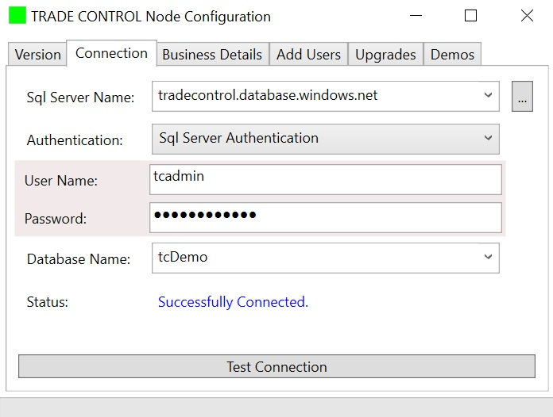
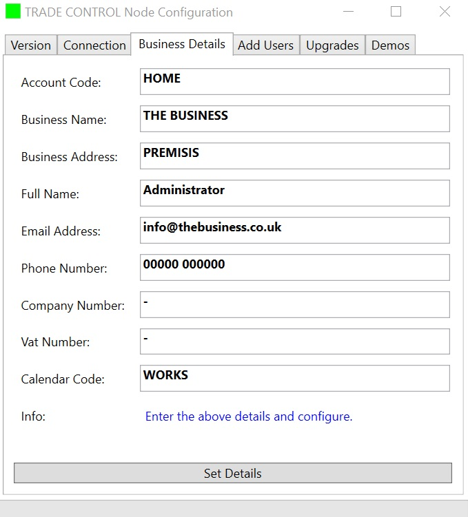
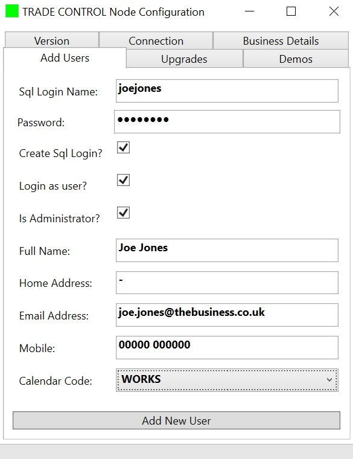
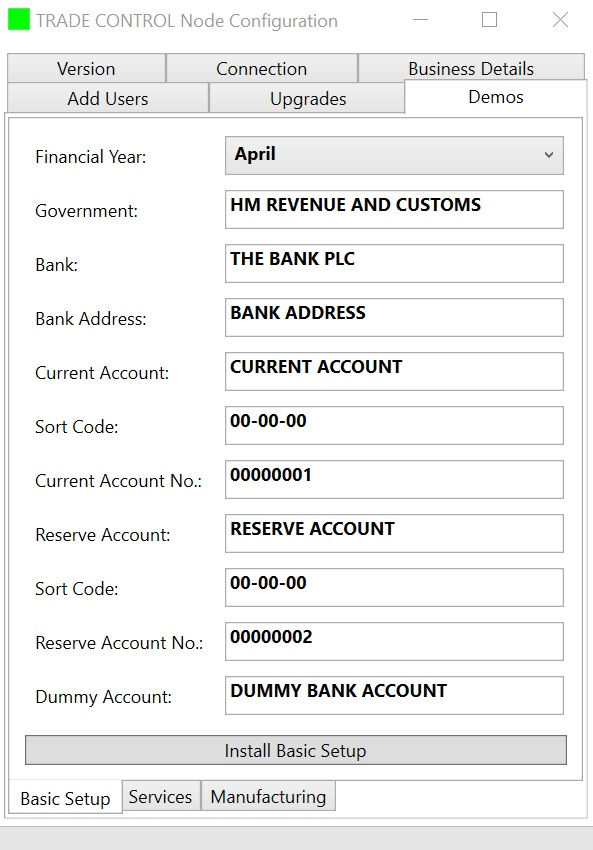

# Deployment

The Trade Control schema can run on any Sql Server instance supporting Compatibility Level 2016 (130) or higher.

The best place to deploy is Azure Sql, starting with the basic price tier. Each database costs a few pounds per month; it is globally available, backed up and secure.

Alternatively, an enterprise instance on the corporate network if you have one.
For a single, offline local deployment, use the free Sql Server Express. 

Whilst Sql Servers using Windows Authentication are supported, the following assumes you are using Azure. For the former, consult the relevant documentation.

## Database

If you are not already registered with Microsoft Azure, sign up for the basic service. 
Follow the instructions for creating an Sql Database. Name the server after your business and use an admin name for the user account. Create a database named **tcBusinessName** and/or **tcDemo**.  To avoid unnecessary costs, make sure you begin by setting the pricing tier to basic. You can uprate it later. Note the name of your server, which will be something like _businessname.database.windows.net_ or copy the .Net connection string in the Azure portal.

## Configurator

Download and install the C# app into a 64 bit Windows environment. Run setup.exe to install missing dependencies.

[TC Configuration app](../src/installation/tcNodeConfigSetup.zip)

> Note: some older versions of Windows are not compatible with .NET Framework 4.7.2. If affected, you must update the OS or recompile the solution with a lower versioned framework. 

The .NET assembly version is the same as the TC-Node that it installs or upgrades. This is displayed on the first page.

Errors are shown on the appropriate page but are also written to an error log in more detail. File _tcnodeconfig_errorlog.csv_ can be found in the _Documents\Trade Control_ folder.

### Connection

When you first load the app, it will request a connection. It must be to either an empty database or a valid TC instance. Otherwise the connection request will be rejected. Below is a valid example. If you are creating a new instance, make sure you log on with your Azure Sql Server admin account.

The button to the far right of the server name will collect local instances of Sql Server. For Azure, type in the server name manually.

When you test the connection, a series of checks are applied to assess its current state. If this results in an action, the test is automatically re-applied. The checks are:

1. When the current version is greater than the installed version, apply the upgrade scripts until they are equal.
2. If the database is empty, install the creation script followed by all upgrades.
3. Once an empty schema is present, request business details to configure the instance.
4. Allow the administrator to add new data users to the instance.
5. Login as the data user and initialise the instance for clients 
6. Activate the Basic Setup demo.
7. Enable demos installation when a basic setup has been installed.

### Business Details

The details below are all you need to install an instance that can be used by clients. However, if you have never used Trade Control before, it will be difficult to know how to proceed. Either you can accept these defaults and try out the demos; or enter the correct information, add yourself as a data user and then install a [basic setup](#basic-setup).

Refer to procedure _App.proc_NodeInitialisation()_ for the T-SQL that first configures the instance. Its parameters match the data specified on this page, but it also adds the administrator account and populates the [enumerated type tables](tc_coding_practice.md)
 
### Add Users

Once you have entered your business details, you will be able to connect from a client using your admin credentials. However, it is recommended that you create at least one user account for yourself that does not have administrative permissions to the database. 

If the user is already registered with the server, you can leave the password blank and the Create Sql Login and Login as User flags will be disabled. When the Login as User flag is checked, the user will be created and the connection changed to the new user. This is what you should do when you first create a Basic Set-up or run the Demos. Otherwise the objects will be assigned to the administrator account.

Checking the IsAdministrator flag gives rights to the **Usr** schema. It is necessary if you intend to run the demo scripts under this account. It does not, however, give the user administrative rights to the database.

New users are added by calling the procedure _Usr.proc_AddUser()_. It carries out the following operations:

1. Creates the user for database login.
2. Grants the user read/write permissions on data tables and functions. 
3. Grants execute permission on stored procedures.
4. Denies write permission on system tables
5. Adds the user to the **Usr** schema tables so they can log into a client. 
6. Denies write permission for the **Usr** schema if the IsAdministrator flag is off.

### Basic Setup

Unless you know what you are doing, you should install the Basic Set-up. You can modify everything from a client, but you will not be starting with a blank canvas.

Login as a data user. Either enter your correct details if this is the live database, or just accept the defaults for the demo. If you do not have a reserve account, leave the defaults. You can edit/delete all these settings later from a client.

These settings are passed as parameters to the procedure _App.proc_BasicSetup_. It registers your Government and bank accounts, but also adds the following:

- Units of Measure
- Time Buckets
- Tax Codes
- Financial years and periods 
- Cash and Category Codes
- Cash Totals for net and gross profit
- Corporation tax levels
- Government and Cash Code assignment to Tax Types

### Demos

You are now able to install the services or manufacturing demo. This is straight forward and explained in the [client documentation](https://github.com/tradecontrol/tc-office)
